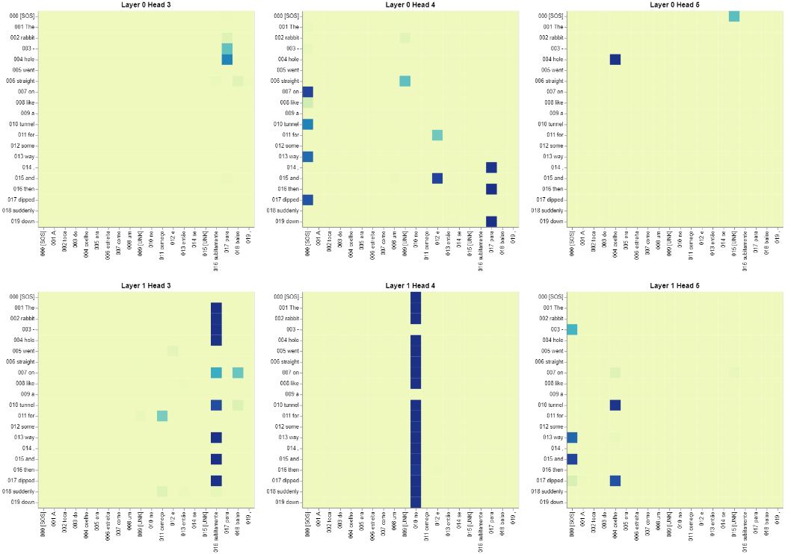

# Transformer from Scratch

This repository contains a custom implementation of the Transformer architecture as described in the paper *"Attention Is All You Need"* by Vaswani et al. The model was implemented from scratch using PyTorch and focuses on the task of translating text from English to Portuguese. 

## Features
- **Transformer Architecture**: The model follows the original Transformer design, including self-attention mechanisms, multi-head attention, positional encodings, and encoder-decoder structure. 
- **Visualization**: A Jupyter Notebook is included to visualize the attention mechanism, with interactive visualizations to help understand the inner workings of the model.

## Notes
- This implementation may contain some bugs or inconsistencies.
- The model's performance has not been thoroughly validated, so translations might not be perfect.

## Example Visualization
Below is an example of the attention visualization generated by the notebook:

